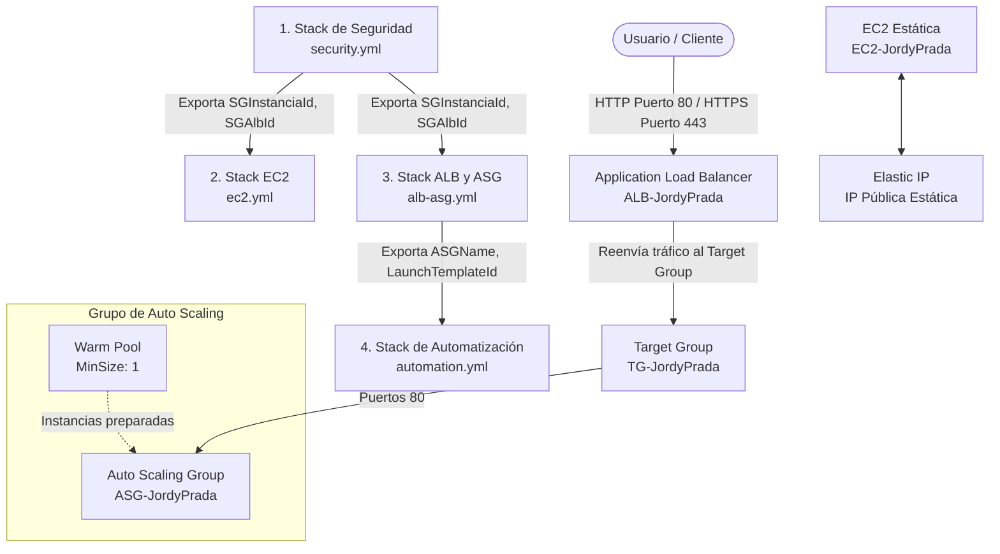

# Examen Cloud - Infraestructura como Código y CI/CD ☁️

Este repositorio contiene la definición de infraestructura como código (IaC) utilizando **AWS CloudFormation** y la automatización del ciclo de vida de despliegue mediante tuberías de integración y despliegue continuos (CI/CD) con **GitHub Actions**.

El proyecto está diseñado bajo buenas prácticas de modularidad, alta disponibilidad, seguridad y automatización de escalado.

---

## 🏗️ Arquitectura de la Infraestructura

La arquitectura está dividida en cuatro capas (stacks) interconectadas. A continuación, se presenta un diagrama visual de dependencias y flujo de tráfico:



---

## 📂 Estructura del Proyecto

El proyecto está organizado de la siguiente manera:

*   **`cloudformation/`**: Carpeta que almacena las plantillas de AWS CloudFormation en formato YAML.
    *   [security.yml](file:///c:/Users/Jordy/Documents/1.%20UFPSO/9.%20semestre/Cloud%20Computing/Examen_Cloud_JordyPrada/cloudformation/security.yml): Configuración de los grupos de seguridad.
    *   [ec2.yml](file:///c:/Users/Jordy/Documents/1.%20UFPSO/9.%20semestre/Cloud%20Computing/Examen_Cloud_JordyPrada/cloudformation/ec2.yml): Definición de la instancia EC2 pública con dirección IP elástica asociada.
    *   [alb-asg.yml](file:///c:/Users/Jordy/Documents/1.%20UFPSO/9.%20semestre/Cloud%20Computing/Examen_Cloud_JordyPrada/cloudformation/alb-asg.yml): Configuración del balanceador de carga de aplicaciones (ALB), Target Group, Auto Scaling Group y Warm Pool.
    *   [automation.yml](file:///c:/Users/Jordy/Documents/1.%20UFPSO/9.%20semestre/Cloud%20Computing/Examen_Cloud_JordyPrada/cloudformation/automation.yml): Acciones programadas de escalado automático y versión 2 de Launch Template.
*   **`.github/workflows/`**: Flujos de trabajo de GitHub Actions para el despliegue y destrucción automatizados.
    *   [deploy.yml](file:///c:/Users/Jordy/Documents/1.%20UFPSO/9.%20semestre/Cloud%20Computing/Examen_Cloud_JordyPrada/.github/workflows/deploy.yml): Pipeline que orquesta el despliegue secuencial y la gestión de errores.
    *   [destroy.yml](file:///c:/Users/Jordy/Documents/1.%20UFPSO/9.%20semestre/Cloud%20Computing/Examen_Cloud_JordyPrada/.github/workflows/destroy.yml): Pipeline manual para la eliminación limpia de los recursos de AWS en orden inverso.

---

## 🛠️ Detalles de los Componentes (CloudFormation)

### 1. Seguridad ([security.yml](file:///c:/Users/Jordy/Documents/1.%20UFPSO/9.%20semestre/Cloud%20Computing/Examen_Cloud_JordyPrada/cloudformation/security.yml))
Define los accesos de red y las reglas de seguridad.
*   **Recursos Creados:**
    *   `SGInstanciaJordyPrada`: Grupo de seguridad para las instancias EC2. Permite entrada por el puerto `22` (SSH) y el puerto `80` (HTTP) desde cualquier dirección IPv4 (`0.0.0.0/0`).
    *   `SGAlbJordyPrada`: Grupo de seguridad para el Application Load Balancer (ALB). Permite entrada por el puerto `80` (HTTP) y el puerto `443` (HTTPS) desde cualquier origen.
*   **Valores Exportados:**
    *   `SGInstanciaId`: Identificador del grupo de seguridad de las instancias para ser usado en otros stacks.
    *   `SGAlbId`: Identificador del grupo de seguridad del ALB.

### 2. Servidor EC2 Estático ([ec2.yml](file:///c:/Users/Jordy/Documents/1.%20UFPSO/9.%20semestre/Cloud%20Computing/Examen_Cloud_JordyPrada/cloudformation/ec2.yml))
Implementa un servidor web estático con persistencia de dirección IP.
*   **Parámetros:**
    *   `SubnetId`: Identificador de la subred donde se lanzará la instancia.
*   **Recursos Creados:**
    *   `EC2JordyPrada`: Instancia EC2 de tipo `t3.micro` que utiliza la última imagen de Amazon Linux 2023 (`al2023-ami-kernel-default-x86_64`). En su script de inicio (`UserData`), realiza lo siguiente:
        ```bash
        #!/bin/bash
        yum update -y
        yum install -y httpd
        systemctl start httpd
        systemctl enable httpd
        echo '<h1>Hola desde Ocana, Norte de Santander</h1>' > /var/www/html/index.html
        ```
    *   `ElasticIPJordyPrada`: IP elástica estática asociada a la instancia EC2 para garantizar que la dirección IP pública sea fija.
*   **Valores de Salida:**
    *   `PublicIP`: Dirección IP pública estática de la instancia.
    *   `InstanceId`: Identificador de la instancia EC2.

### 3. Balanceo y Escalado ([alb-asg.yml](file:///c:/Users/Jordy/Documents/1.%20UFPSO/9.%20semestre/Cloud%20Computing/Examen_Cloud_JordyPrada/cloudformation/alb-asg.yml))
Permite distribuir el tráfico entrante de manera equitativa y escalar de forma dinámica.
*   **Parámetros:**
    *   `VpcId`: VPC destino.
    *   `SubnetIds`: Lista de subredes públicas sobre las cuales el ALB operará.
*   **Recursos Creados:**
    *   `TargetGroupJordyPrada`: Grupo de destino (puerto 80, HTTP) con verificación de estado en la ruta `/` cada 30 segundos.
    *   `ALBJordyPrada`: Balanceador de carga orientado a internet configurado con el grupo de seguridad de ALB.
    *   `ListenerALB`: Listener en el puerto 80 que reenvía todo el tráfico HTTP entrante al Target Group.
    *   `LaunchTemplateJordyPrada`: Plantilla de lanzamiento básica (`LT-JordyPrada`) de tipo `t3.micro` con servidor Apache preinstalado que responde `"ASG - JordyPrada"`.
    *   `ASGJordyPrada`: Grupo de Auto Scaling con un tamaño mínimo de 1, máximo de 3 y capacidad deseada de 2 instancias. Distribuido en las subredes seleccionadas.
    *   `WarmPoolJordyPrada`: Un grupo de precalentamiento con un tamaño mínimo de 1 instancia, lo que optimiza los tiempos de respuesta ante picos de carga súbitos al mantener instancias listas en estado de reposo.
*   **Valores Exportados:**
    *   `ALBDns`: Nombre DNS público del ALB.
    *   `ASGName`: Nombre físico del Auto Scaling Group.
    *   `LaunchTemplateId`: Identificador del Launch Template.

### 4. Automatización de Escalado y LT V2 ([automation.yml](file:///c:/Users/Jordy/Documents/1.%20UFPSO/9.%20semestre/Cloud%20Computing/Examen_Cloud_JordyPrada/cloudformation/automation.yml))
Orquesta el comportamiento temporal y las actualizaciones de las plantillas.
*   **Recursos Creados:**
    *   **Acciones Programadas (Scheduled Actions):**
        *   `ScaleUp1JordyPrada`: Sube la capacidad deseada a `3` instancias de lunes a viernes a las 08:00 AM.
        *   `ScaleUp2JordyPrada`: Sube la capacidad deseada a `3` instancias los sábados a las 12:00 PM.
        *   `ScaleDown1JordyPrada`: Reduce la capacidad deseada a `1` instancia de lunes a viernes a las 08:00 PM.
        *   `ScaleDown2JordyPrada`: Reduce la capacidad deseada a `1` instancia los sábados a las 10:00 PM.
    *   `LaunchTemplateV2JordyPrada`: Plantilla de lanzamiento versión 2 (`LT-V2-JordyPrada`), que configura el servidor Apache para desplegar una nueva versión de la aplicación: `"Version 2 - JordyPrada"`.

---

## 🚀 Pipeline de Despliegue (GitHub Actions)

El archivo [deploy.yml](file:///c:/Users/Jordy/Documents/1.%20UFPSO/9.%20semestre/Cloud%20Computing/Examen_Cloud_JordyPrada/.github/workflows/deploy.yml) automatiza el despliegue completo en AWS al realizar un `push` a la rama `master`.

### Características Clave del Pipeline:
1.  **Limpieza Inteligente de Errores previos (`ROLLBACK_COMPLETE`):**
    Antes de intentar realizar un despliegue, el pipeline analiza si alguno de los stacks de CloudFormation está en estado `ROLLBACK_COMPLETE` (estado que bloquea actualizaciones y despliegues posteriores). Si es así, ejecuta una función de limpieza que los elimina automáticamente para permitir el despliegue del nuevo código sin intervención manual.
2.  **Depuración Detallada:**
    Si un despliegue de CloudFormation falla, el pipeline captura los eventos de error del stack mediante `describe-stack-events`, filtrando específicamente los recursos que fallaron y sus justificaciones (`CREATE_FAILED`, `UPDATE_FAILED`), facilitando la depuración rápida directamente desde la consola de GitHub Actions.
3.  **Despliegue Secuencial Ordenado:**
    El pipeline implementa las plantillas de infraestructura de manera ordenada respetando las dependencias:
    $$\text{Seguridad (security.yml)} \rightarrow \text{EC2 Estática (ec2.yml)} \rightarrow \text{Balanceo/Escalado (alb-asg.yml)} \rightarrow \text{Automatización (automation.yml)}$$

---

## 🗑️ Pipeline de Destrucción (GitHub Actions)

El archivo [destroy.yml](file:///c:/Users/Jordy/Documents/1.%20UFPSO/9.%20semestre/Cloud%20Computing/Examen_Cloud_JordyPrada/.github/workflows/destroy.yml) permite desmantelar de manera controlada e inversa toda la infraestructura creada para evitar costos innecesarios en AWS. Se ejecuta manualmente a través de la opción **Workflow Dispatch** en la interfaz de GitHub Actions.

### Secuencia de Destrucción:
El pipeline elimina los stacks esperando a que cada uno se complete antes de proceder al siguiente:
1.  **Elimina Automation Stack** (`Automation-JordyPrada`)
2.  **Elimina ALB-ASG Stack** (`ALB-ASG-JordyPrada`)
3.  **Elimina EC2 Stack** (`EC2-JordyPrada`)
4.  **Elimina Security Stack** (`SecurityGroups-JordyPrada`)

---

## 🔑 Configuración Requerida en GitHub

Para que los pipelines funcionen correctamente, debes configurar los siguientes secretos en tu repositorio de GitHub (`Settings > Secrets and variables > Actions`):

| Nombre del Secreto | Descripción |
| :--- | :--- |
| `AWS_ACCESS_KEY_ID` | Tu ID de clave de acceso de AWS. |
| `AWS_SECRET_ACCESS_KEY` | Tu clave de acceso secreta de AWS. |

> [!IMPORTANT]
> Asegúrate de que las credenciales de AWS tengan políticas asociadas para crear, actualizar y borrar recursos de CloudFormation, EC2, IAM, Auto Scaling y Elastic Load Balancing.

---

## ⚙️ Parámetros de Red por Defecto
El pipeline utiliza los siguientes recursos por defecto de AWS en la región `us-east-1` (Virginia):
*   **VPC:** `vpc-0551a786fff021d6f`
*   **Subredes Públicas:**
    *   `subnet-00d1e46d42df52365` (Usada para el EC2 estático y ALB)
    *   `subnet-036910dc9f91bd9a3` (Usada para el ALB para cumplir con el requisito de alta disponibilidad multizona)